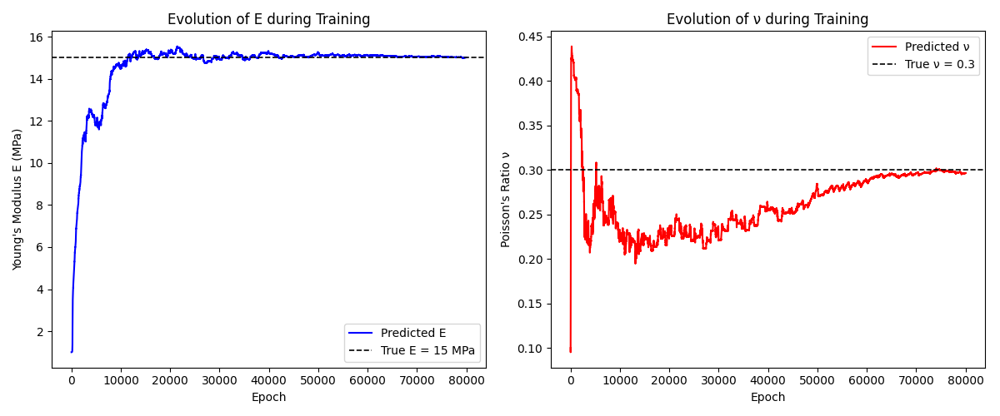

# PINNs-For-Inverse-Linear-Elasticity
Inverse analysis of linear elastic problems using Physics-Informed Neural Networks (PINNs).

## Features  
- Physics-Informed Neural Network (PINN) formulation  
- Inverse identification of Young’s modulus and Poisson’s ratio  
- Enforcement of equilibrium, constitutive, and kinematic equations  
- Handling of sparse and noisy displacement data  
- Automatic differentiation for strain and stress computation

## Governing Equations  

The following equations are enforced in the loss function:

$$
\nabla \cdot \boldsymbol{\sigma} + \mathbf{b} = 0
$$

$$
\boldsymbol{\sigma} = \mathbb{C} : \boldsymbol{\varepsilon}
$$

$$
\boldsymbol{\varepsilon} = \frac{1}{2}\left( \nabla \mathbf{u} + (\nabla \mathbf{u})^{T} \right)
$$

## Results
-  **All results**
  
  
  
  

## Author
Apisit Robjanghvad : M.eng (Geotechnical engineering student), Department of Civil Engineering King Mongkut's University of Technology Thonburi (KMUTT) Email: [apisit65a@gmail.com]

## Installation
Install the necessary tools using:
```bash
pip install torch
pip install matplotlib
pip install numpy
pip install pandas
pip install pytorch


